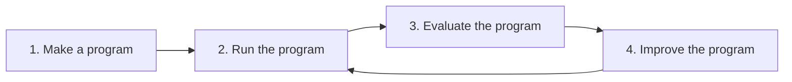

# Promptuna

Production LM apps are rarely bare `complete()` calls. They are Python functions with pre-processing, a prompt template, and post-processing that turns model output into something useful. **`promptuna` evaluates those functions, scores them with named metrics, and searches for better prompt templates**.



## Installation

`uv add promptuna`

## Usage

Wire a program, define metrics, run an experiment, then let the optimizer rewrite the prompt:

```python
from lmdk import complete, render_template

from promptuna.evaluate import Ordinal, ProgrammaticMetric, RawScore, run_experiment
from promptuna.optimize import optimize
from promptuna.program import Example, Experiment, LMConfig


def classify_sentiment(review: str, prompt_template: str, config: LMConfig) -> str:
    prompt = render_template(template=prompt_template, REVIEW=review)
    response = complete(
        model=config.model,
        generation_kwargs=config.generation_kwargs,
        prompt=prompt,
    )
    return response.content.strip().lower()


examples = [
    Example(inputs={"review": "Battery lasts two days. Love it."}, reference="positive"),
    Example(inputs={"review": "Stopped charging after a week."}, reference="negative"),
]

config = LMConfig(model="mistral:mistral-small-latest", generation_kwargs={"temperature": 0.1})
prompt_template = "Classify the sentiment of this review as positive or negative:\n\n{{ REVIEW }}"

experiment = Experiment(program=classify_sentiment, prompt_template=prompt_template, config=config)


def label_match(output: str, example: Example) -> RawScore:
    return RawScore(raw=output == example.reference)


accuracy = ProgrammaticMetric(
    name="accuracy",
    description="Whether the predicted label matches the reference.",
    scale=Ordinal(levels=[False, True]),
    scorer=label_match,
)

results = run_experiment(experiment=experiment, examples=examples, metrics=[accuracy])
print(results.overall.mean)

optimization = optimize(
    experiment=experiment,
    examples=examples,
    metrics=[accuracy],
    proposer_config=LMConfig(model="mistral:mistral-small-latest"),
    steps=3,
)
print(optimization.best.prompt_template)
```

**See the [getting started notebook](getting_started.ipynb) for a full worked example** — pre/post-processing around structured output, LLM-as-judge metrics, markdown reports, and a harder dataset where optimization has room to improve.

<details>
<summary>LLM-as-judge metrics</summary>

Subjective quality dimensions (tone, justification, faithfulness) have no ground truth. Define an `LLMJudgeMetric` with its own `LMConfig` and use the built-in `default_llm_judge` scorer:

```python
from promptuna.evaluate import LLMJudgeMetric, default_llm_judge

reason_quality = LLMJudgeMetric(
    name="reason_quality",
    description="Rates how well the justification supports the predicted label.",
    scale=Ordinal(levels=["poor", "good"]),
    scorer=default_llm_judge,
    config=LMConfig(model="mistral:mistral-medium-latest"),
)

run_experiment(experiment=experiment, examples=examples, metrics=[accuracy, reason_quality])
```

Pass a `list[Metric]` — each metric keeps its own name, scale, and scorer. Results aggregate into a single headline score for ranking (see [optimize](#optimize) below).
</details>

<details>
<summary>Reports</summary>

Render experiment and optimization trajectories as markdown:

```python
from promptuna.optimize import render_history
from promptuna.report import render_run

report = render_run(results)
history = render_history(optimization)
```
</details>

## How it works

The loop maps directly onto the package layout:

| Step | Module | Role | Key API |
| --- | --- | --- | --- |
| 1. Make a program | [`promptuna.program`](src/promptuna/program.py) | Wire what is under test | `Program`, `Example`, `Experiment`, `LMConfig` |
| 2. Run the program | [`promptuna.run`](src/promptuna/run.py) | Execute a program on one dataset row | `run_trial`, `Trial` |
| 3. Evaluate the program | [`promptuna.evaluate`](src/promptuna/evaluate.py) | Score trials and run full experiments | `Metric`, `run_experiment`, `RunResults`, `default_llm_judge` |
| 4. Improve the program | [`promptuna.optimize`](src/promptuna/optimize.py) | Search for a better prompt template | `optimize`, `Step`, `OptimizationResult` |

### program

An [`Example`](src/promptuna/program.py) is one dataset row: `inputs` (unpacked as keyword arguments) and an optional `reference` for ground-truth metrics. A [`Program`](src/promptuna/program.py) is any function that takes those inputs plus a `prompt_template` and `LMConfig`, runs **exactly one** LM completion (with arbitrary deterministic code before and after), and returns whatever downstream scorers need. An [`Experiment`](src/promptuna/program.py) bundles the program with the template and model config under test.

### run

[`run_trial`](src/promptuna/run.py) executes one `Example` through the experiment. The harness captures the underlying `lmdk` request/response via `observe()`, so the program does not need to surface them. Failures become `FailedTrial` instead of raising — the executor keeps going.

### evaluate

[`run_experiment`](src/promptuna/evaluate.py) runs every example (with optional `repeats` per replicate) and scores each against every metric in parallel. Metrics declare a typed [`Scale`](src/promptuna/evaluate.py) (`Range`, `Ordinal`, …) and a scorer — plain Python (`ProgrammaticMetric`) or an LLM judge (`LLMJudgeMetric`). Scores normalize to `[0, 1]`; [`RunResults`](src/promptuna/evaluate.py) aggregates per-metric means and an overall headline.

### optimize

[`optimize`](src/promptuna/optimize.py) is OPRO-style prompt search. It evaluates the baseline template, then repeatedly asks a *proposer* model to rewrite the template from the full scored trajectory and re-runs the experiment on each candidate. The archive keeps every checkpoint; [`OptimizationResult.best`](src/promptuna/optimize.py) is the highest-scoring step seen.

Evaluation is **multi-criteria**: each candidate is scored on several normalized metrics, forming a quality vector in metric space. Before comparing checkpoints, that vector is collapsed by a fixed **linear scalarization** — the unweighted mean of per-metric means (`RunResults.overall.mean`), a compensatory aggregation where gains on one metric can offset losses on another. The search is therefore **single-objective** in template space: it maximizes one scalar utility, keeps the best checkpoint seen so far, and does not explore a Pareto front over metrics. The proposer still receives per-metric breakdowns in the trajectory (`render_history`); only ranking and early stopping use the headline score.

### report

[`promptuna.report`](src/promptuna/report.py) renders `RunResults` and optimization trajectories as markdown (`render_run`, `render_history`) for notebooks, logs, or CI artifacts.

## Inspiration

`promptuna` is a proud Frankenstein of [DSPy](https://github.com/stanfordnlp/dspy), [Ragas](https://github.com/vibrantlabsai/ragas), [OPRO](https://arxiv.org/pdf/2309.03409) and [Optuna](https://github.com/optuna/optuna).

First and foremost, `promptuna`'s value proposition is most similar to [DSPy](https://github.com/stanfordnlp/dspy). The differences:
- **Programs:** DSPy models a program as a composable graph of predictors (`dspy.Module`). `promptuna` treats a program as an ordinary Python function: arbitrary pre/post-processing around a completion call, without forcing signature/module abstractions.
- **Evaluation.** DSPy passes a single metric callable to its optimizers. Multiple quality dimensions must be folded into that one function by hand. `promptuna` takes a `list[Metric]` instead: each metric has its own name, scale (`Range`, `Ordinal`, …), and scorer (programmatic or LLM judge). Results are naively aggregated to collapse multiple metrics into the single optimization objective.
- **Optimization.** DSPy offers several teleprompters. `promptuna`'s simple optimizer is OPRO-style: it rewrites a free-form prompt template from a trajectory, using the same multi-metric evaluation harness at every step, keeping the full metric breakdown visible throughout the search.

Some ideas regarding evaluation metrics are taken from the seemingly already abandoned [ragas](https://github.com/vibrantlabsai/ragas): named metrics where an LLM judge scores a trial against a rubric, with typed scales and optional rationales.

The optimization loop itself takes concepts from [DeepMind's OPRO](https://arxiv.org/pdf/2309.03409): at each step an LM proposer rewrites the prompt template from scratch using the full scored history of prior candidates.

The name of the package itself is a reference to the infamous [Optuna](https://github.com/optuna/optuna): a fixed-budget search over trials that archives every checkpoint and returns the best one seen.

## Development

This package uses [`lmdk`](https://github.com/nachollorca/lmdk) to inference LLMs.

### Tooling
We use `just` for development tasks. Use:
- `just install`: Sync environment from the lockfile.
- `just format`: Lints and formats with `ruff`.
- `just check-types`: Static analysis with `ty`.
- `just check-complexity`: Cyclomatic complexity checks with `complexipy`.
- `just test`: Runs pytest with 90% coverage threshold.
- `just notebook`: Launches Jupyter Lab.

See [`justfile`](justfile) for a complete list of dev commands.

### Contribute
1. **Hooks**: Install pre-commit hooks via `just install-hooks`. PRs will fail CI if linting/formatting is not applied.
2. **Issues**: Open an issue first using the default template.
3. **PRs**: Link your PR to the relevant issue using the PR template.

## License
MIT

_Made with [`mold`](https://github.com/nachollorca/mold) template_
