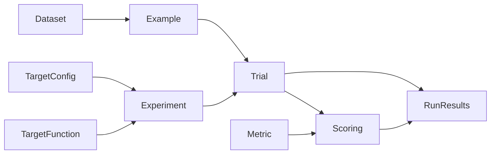
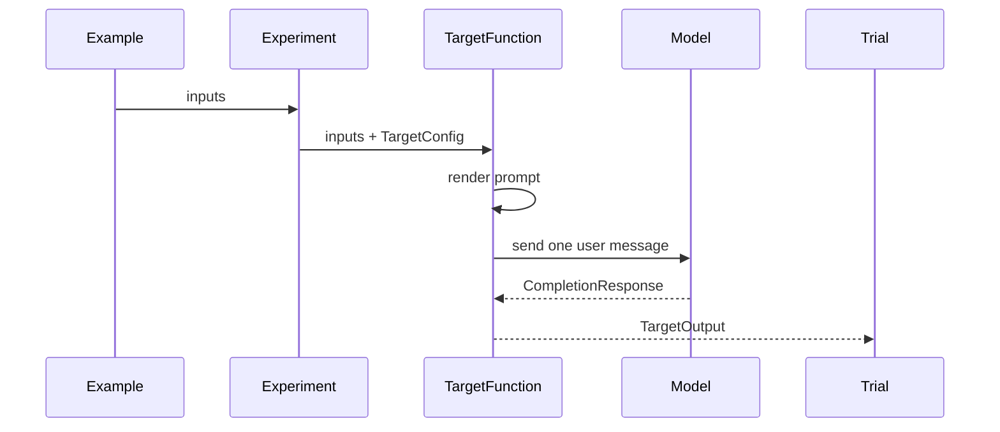
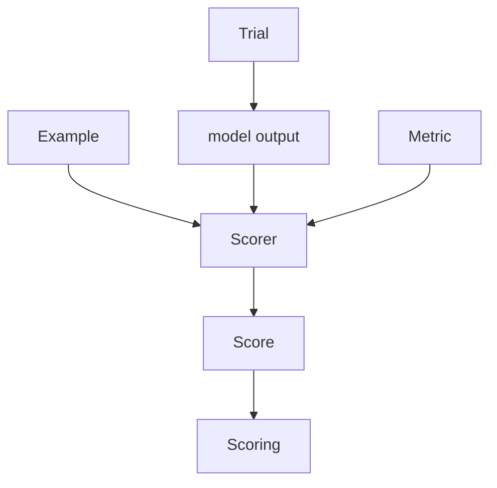
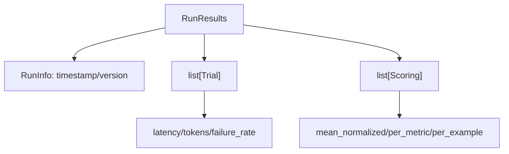
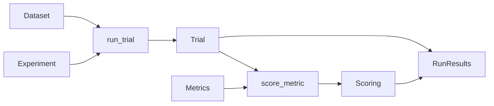

# Language Model Evaluation Harness

`lmeh` evaluates *functions that use an LM* to accomplish a goal, not bare completion calls.

Such `TargetFunction` is expected to perform exactly one LM completion, optionally surrounded by arbitrary deterministic code that prepares the prompt (pre-processing) and refines the model's output (post-processing). The harness treats the target as a black box and separates **generation** from **scoring**: a target function runs a model and produces trials; metrics score those trials afterwards.

## 1. The cast



- **Example**: one dataset row. It has `inputs` for the prompt and an optional `reference` answer.
- **Dataset**: a list of examples.
- **TargetConfig**: the model, prompt template, generation options, and optional structured output schema to test.
- **TargetFunction**: your model-calling function. It receives an example's inputs plus a `TargetConfig`, renders the prompt, calls the model, and returns a `TargetOutput` (wrapping the raw `CompletionResponse` plus the post-processed `output`).
- **Experiment**: a named pair of `TargetFunction + TargetConfig`.
- **Trial**: the result of running one experiment on one example. Modeled as a tagged union — `SuccessfulTrial` holds the `TargetOutput`, `FailedTrial` holds the exception.
- **Metric**: a scoring definition: what to measure, the score scale, and the scorer function (plus optional `judge_config` for LLM judges).
- **Scoring**: one metric applied to one trial. Also a tagged union — `SuccessfulScoring` carries a `Score`, `FailedScoring` carries the exception raised by the scorer.
- **RunResults**: the complete output of a run: all trials, all scorings, run metadata, and aggregate helpers.

## 2. Generation: examples become trials



The harness does **not** render prompts itself. Prompt rendering belongs to the `TargetFunction`. After the call, the exact prompt can be read from `SuccessfulTrial.rendered_prompt`, which inspects the request attached to the returned `CompletionResponse`.

If the target raises, the harness records a `FailedTrial` carrying the exception instead of a `SuccessfulTrial`. The run continues and failures are reflected in `failure_rate`.

## 3. Scoring: trials become scorings



A `Metric` defines how a trial should be scored:

- `scale` validates raw scores and maps them to `[0, 1]`.
- `scorer` computes the score. Metrics that need a reference simply read `example.reference` inside the scorer.
- `judge_config` sets the model configuration if the `LLMJudgeScorer` is used.

When a scorer raises, the harness records a `FailedScoring` instead of a `SuccessfulScoring`. Failed scorings are excluded from quality aggregates (so a flaky judge does not bias the run) and surfaced separately via `scoring_failure_rate`.

There are two scorer shapes:

```text
ProgrammaticScorer(output, example) -> Score
LLMJudgeScorer(output, example, judge_config, rendered_prompt) -> Score
```

Programmatic scorers are normal Python checks. LLM-judge scorers use an LLM and also receive the rendered target prompt, so the judge can evaluate the answer in context.

## 4. Scores and scales

Every scorer returns a `Score`:

```text
Score(raw=<native metric value>, normalized=<0..1>, reason=<optional rationale>)
```

The raw value stays in the metric's own language, while `normalized` gives the harness a common aggregation scale.

Built-in scale types:

- **Range**: a continuous numeric interval, for example `0.0` to `10.0`.
- **Ordinal**: ordered discrete levels, for example `['bad', 'ok', 'great']` or `[1, 2, 3, 4, 5]`.

## 5. The final shape of a run



`RunResults` keeps two parallel views:

1. **Trials** (`list[SuccessfulTrial | FailedTrial]`): one per example. Use these for telemetry such as latency, token counts, and failures. This avoids counting the same model call once per metric. Helpers: `successful_trials`, `successful_responses`, `failure_rate`, `mean_latency`, `mean_output_tokens`, `total_output_tokens`.
2. **Scorings** (`list[SuccessfulScoring | FailedScoring]`): one per `(trial, metric)` pair. Use these for quality aggregation. Helpers: `successful_scorings`, `mean_normalized`, `per_example`, `per_metric`, `scoring_failure_rate`.

In short:

```text
Dataset + Experiment -> Trials
Trials + Metrics     -> Scorings
Trials + Scorings    -> RunResults
```

That is the core contract: targets generate, metrics score, and run results summarize both without mixing their responsibilities.

## 6. Running an experiment

The execution module (`src/lmeh/execution.py`) turns the data contracts above into actual runs. It exposes two entry points sharing the same threaded engine:

- **`run_experiment(experiment, dataset, metrics, workers=1) -> RunResults`**: blocks until the whole run completes and returns a fully-populated `RunResults`.
- **`stream_experiment(experiment, dataset, metrics, workers=1) -> Iterator[Trial | Scoring]`**: yields trials and scorings as soon as they are ready, so callers can render progress bars or persist partial results and survive mid-run crashes.



### Concurrency model

Both entry points use a single `ThreadPoolExecutor` shared between target calls and LLM-judge scorers, so workers stay saturated: scoring for an example starts as soon as its trial completes, without waiting for the rest of the dataset to finish.

- Target calls are submitted up front, one future per example.
- As each trial lands (`as_completed`), it is yielded immediately, then its scorings are dispatched:
  - **Programmatic scorers** run inline on the consumer thread — they are cheap and not I/O-bound.
  - **LLM-judge scorers** are offloaded back to the same pool.
- Once all trials are drained, remaining judge scorings are yielded in completion order.

Order of yielded items is therefore **not deterministic**, but a trial is always yielded before any of its scorings.

### Total functions: failures are data, not exceptions

`run_trial` and `score_metric` are *total*: they never raise. Anything thrown by user code is captured and wrapped, so the executor loop stays trivial and the run always completes.

- **`run_trial(target, config, example) -> Trial`**: calls the target; on exception returns a `FailedTrial` carrying the error. The target is what's under evaluation, so its failures belong in the results.
- **`score_metric(trial, metric) -> Scoring`**: applies the metric to the trial.
  - If the trial is a `FailedTrial`, short-circuits to a sentinel `SuccessfulScoring` with `Score(raw=0, normalized=0.0, reason="trial failed: ...")` so failures still drag down quality aggregates.
  - Dispatches to `ProgrammaticScorer` or `LLMJudgeScorer` based on `metric.judge_config`.
  - Validates `score.raw` against `metric.scale` and **recomputes** `score.normalized` from the scale (the scorer-provided normalized value is overwritten to keep the contract consistent).
  - Any exception (scorer crash, malformed judge output, out-of-scale value) becomes a `FailedScoring`.

### Preflight validation

Before any LM call is made, `_validate_run` performs cheap, network-free checks and raises `ValueError` on the first problem found:

- Dataset is non-empty and does not mix examples with and without `reference` (all-or-nothing, so reference-dependent metrics are unambiguous).
- At least one metric is provided, and metric names are unique.
- Every LLM-judge metric has a non-empty `judge_config.model`.
- `experiment.config.model` and `prompt_template` are non-empty.
- `output_schema`, if set, is a `pydantic.BaseModel` subclass.

This catches configuration mistakes before spending any tokens.

## License
MIT

_Made with (mold)[https://github.com/nachollorca/mold]_
