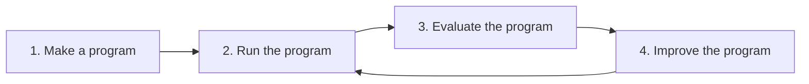

# Promptuna

`promptuna` evaluates and optimizes *functions that use an LM* to accomplish a goal.

Such functions (hereinafter referred to as **programs**) are not thin wrappers around a single `complete()` call. Each program makes **exactly one** LM completion, wrapped in a deterministic **scaffold** — code that shapes inputs and renders the template before the call, and parses or repairs the model output after. In production, users rarely hit the raw completion; they hit the completion plus its scaffold. The harness evaluates that full product.

In the refinement loop below, `promptuna` provides the primitives for you to define the metrics that judge how well your program performs (3). Then, it can use those scores to drive automated improvements on the prompt template (4).

The loop above maps directly onto the package layout:

| Step | Module | Role | Key API |
| --- | --- | --- | --- |
| 1. Make a program | [`promptuna.program`](src/promptuna/program.py) | Wire what is under test | `Program`, `Example`, `Experiment` |
| 2. Run the program | [`promptuna.run`](src/promptuna/run.py) | Execute a program on one dataset row | `run_trial`, `Trial` |
| 3. Evaluate the program | [`promptuna.evaluate`](src/promptuna/evaluate.py) | Score trials and run full experiments | `Metric`, `evaluate`, `RunResults`, `default_llm_judge` |
| 4. Improve the program | [`promptuna.optimize`](src/promptuna/optimize.py) | Search for a better prompt template | `optimize`, `Step`, `OptimizationResult` |

[`promptuna.report`](src/promptuna/report.py) sits alongside evaluation and optimization: it renders `RunResults` and optimization trajectories as markdown (`render_run`, `render_history`).

**See the [getting started notebook](getting_started.ipynb) for a full working example of this cycle end to end.**

## Usage surfaces

`promptuna` can be used in three ways. All non-library surfaces share the same **on-disk project layout** (see [`samples/README.md`](samples/README.md)).

| Surface | Status | How |
| --- | --- | --- |
| **Library** | Available | `pip install promptuna` and wire programs, metrics, and datasets in Python — see [`getting_started.py`](getting_started.py). |
| **Web** | Server available; frontend planned | Run [`promptuna-server`](server/) against a projects root; jobs stream over HTTP + SSE. A SvelteKit UI is planned in [`frontend/`](frontend/). |
| **Agent / terminal** | CLI available | Run [`promptuna-cli`](cli/) against a projects root, or use [`SKILL.md`](SKILL.md) for coding-agent workflows (`run`, `evaluate`, `optimize` from the terminal). |

Projects live as directories under a **projects root** (default: repo `samples/`; override with `PROMPTUNA_PROJECTS_ROOT`). Programs and metrics are Python modules on disk — they cannot be sent over HTTP as JSON — so the server and CLI resolve them locally via name selectors.

## Optimization

Prompt-template search (OPRO-style) treats evaluation as **multi-criteria**: each candidate is scored on several normalized metrics, forming a quality vector in metric space. Before comparing checkpoints, that vector is collapsed by a fixed **linear scalarization**—the unweighted mean of per-metric means (`RunResults.overall.mean`), a compensatory aggregation where gains on one metric can offset losses on another. The search is therefore **single-objective** in template space: it maximizes one scalar utility, keeps the best checkpoint seen so far, and does not explore a Pareto front over metrics. The proposer still receives per-metric breakdowns in the trajectory (`render_history`); only ranking and early stopping use the headline score.

The optimizer uses the metrics to learn the representation of the data and the expectations of the task, then encodes that knowledge in the prompt template.

## Inspiration

`promptuna` is a proud Frankenstein of [DSPy](https://github.com/stanfordnlp/dspy), [Ragas](https://github.com/vibrantlabsai/ragas), [OPRO](https://arxiv.org/pdf/2309.03409)] and [Optuna](https://github.com/optuna/optuna).

First and foremost, `promptuna`'s value proposition is most similar to [DSPy](https://github.com/stanfordnlp/dspy). The differences:
- **Programs:** DSPy models a program as a composable graph of predictors (`dspy.Module`). `promptuna` treats a program as an ordinary Python function with a deterministic scaffold around a single completion call, without forcing signature/module abstractions.
- **Evaluation.** DSPy passes a single metric callable to its optimizers. Multiple quality dimensions must be folded into that one function by hand. `promptuna` takes a `list[Metric]` instead: each metric has its own name, scale (`Range`, `Ordinal`, …), and scorer (programmatic or LLM judge). Results are naively aggregated to collapse multiple metrics into the single optimization objective.
- **Optimization.** DSPy offers several teleprompters. `promptuna`'s simple optimizer is OPRO-style: it rewrites a free-form prompt template from a trajectory, using the same multi-metric evaluation harness at every step, keeping the full metric breakdown visible throughout the search.

Some ideas regarding evaluation metrics are taken from the seemingly already abandoned [ragas](https://github.com/vibrantlabsai/ragas): named metrics where an LLM judge scores a trial against a rubric, with typed scales and optional rationales.

The optimization loop itself takes concepts from [DeepMind's OPRO](https://arxiv.org/pdf/2309.03409): at each step an LM proposer rewrites the prompt template from scratch using the full scored history of prior candidates.

The name of the package itself is a reference to the infamous [Optuna](https://github.com/optuna/optuna): a fixed-budget search over trials that archives every checkpoint and returns the best one seen.

## Versioning and release

This repository is a [uv workspace](https://docs.astral.sh/uv/concepts/projects/workspaces/) with three publishable packages that share one version number:
`promptuna`, `promptuna-cli` and `promptuna-server`.

**Unified versioning.** All three `project.version` fields stay in lockstep (e.g. `1.23.0` everywhere). Satellite packages declare `promptuna==<that version>` so `pip install promptuna-cli` pulls a matching core release.

**What triggers a release.** On every push to `main`, [python-semantic-release](https://python-semantic-release.readthedocs.io/) scans commits since the last tag and decides whether the semver should bump.

**Release steps** (see [`.github/workflows/release.yml`](.github/workflows/release.yml)):

1. PSR bumps the version in `pyproject.toml`, `cli/pyproject.toml`, and `server/pyproject.toml`, then runs [`scripts/sync_workspace_pins.py`](scripts/sync_workspace_pins.py) to refresh the `promptuna==…` pins before committing `chore: release {version}` and tagging `v{version}`.
2. CI builds wheels for all three packages and publishes them to PyPI.
3. A GitHub release is created for the tag.

**Development.** `uv sync --all-groups` (i.e.: `just install`) installs every workspace member locally. PyPI users install only what they need (`promptuna`, `promptuna-cli`, and/or `promptuna-server`).

## License
MIT

_Made with [mold](https://github.com/nachollorca/mold)_
