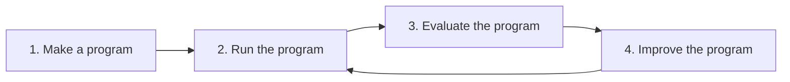

<p align="center">
  
</p>

`promptuna` evaluates and optimizes *functions that use an LM* to accomplish a goal.

In the refinement loop below, promptuna offers the primitives to define metrics that judge how well your program performs (3); the harness can then use those scores to drive automated improvements on the prompt template (4).

For the conceptual basis see the [Whitepaper](#whitepaper).

## The loop



The loop maps directly onto the package layout:

| Step | Module | Role |
| --- | --- | --- |
| 1. Make a program | [`promptuna.program`](src/promptuna/program.py) | Wire what is under test |
| 2. Run the program | [`promptuna.run`](src/promptuna/run.py) | Execute a program on one dataset row |
| 3. Evaluate the program | [`promptuna.evaluate`](src/promptuna/evaluate.py) | Score trials and run full experiments |
| 4. Improve the program | [`promptuna.optimize`](src/promptuna/optimize.py) | Search for a better prompt template |

[`promptuna.report`](src/promptuna/report.py) sits alongside evaluation and optimization: it renders `RunResults` and optimization trajectories as markdown.

## Usage surfaces

`promptuna` can be used in three ways. All non-library surfaces share the same **on-disk project layout** (see [`samples/README.md`](samples/README.md)).

| Surface | When | How |
| --- | --- | --- |
| **Library** | You are building in Python — notebooks, apps, or custom pipelines that call the harness directly | `pip install promptuna`; wire programs, metrics, and datasets in code — [`getting_started.ipynb`](getting_started.ipynb) or [`getting_started.py`](getting_started.py) |
| **Web** | You want HTTP clients or a browser UI to start jobs and stream progress | `pip install promptuna-server`; API — [`server/README.md`](server/README.md). Browser UI — [`frontend/README.md`](frontend/README.md). |
| **Agent / terminal** | You work from a shell or want a coding agent to run evaluate/optimize without writing glue code | `pip install promptuna-cli`; `promptuna run --help` — project layout and agent workflows in [`cli/src/promptuna_cli/SKILL.md`](cli/src/promptuna_cli/SKILL.md) |

Projects live as directories under a **projects root** (default: repo `samples/`; override with `PROMPTUNA_PROJECTS_ROOT`). Programs and metrics are Python modules on disk — they cannot be sent over HTTP as JSON — so the server and CLI resolve them locally via name selectors.

The same three operations are available on every surface:

| Operation | Library | CLI | Server |
| --- | --- | --- | --- |
| Run | `stream_run` | `promptuna run …` | `POST /api/run` |
| Evaluate | `stream_evaluate` | `promptuna evaluate …` | `POST /api/evaluate` |
| Optimize | `stream_optimize` | `promptuna optimize …` | `POST /api/optimize` |
| Report | `render_run`, `render_history` | `promptuna report <job_id>` | `GET /api/jobs/{job_id}/events` (SSE until done) |

Server and CLI jobs persist under `<projects_root>/jobs/<job_id>/`. Routes, SSE event shapes, and Docker deployment are documented in [`server/README.md`](server/README.md).

## Whitepaper

### Programs

A **program** is not a thin wrapper around a single `complete()` call. Each program makes **exactly one** LM completion, wrapped in a deterministic **scaffold** — code that shapes inputs and renders the template before the call, and parses or repairs the model output after. In production, users rarely hit the raw completion; they hit the completion plus its scaffold. The harness evaluates that full product.

### Metrics, not prompts

If you have a task, enough examples, and can say what makes an output good or bad, you should not be hand-writing prompts. Encode quality as **metrics** and let an LM run the loop: execute the program, score the outputs, revise the template, repeat. That work is tedious for humans—running cases in bulk, staying consistent across hundreds of examples, iterating without losing thread—but it is exactly what an automated proposer is for.

**Domain experts should define what good means, not how to phrase it.** Spend effort on rubrics, edge cases, and scoring logic; let search discover the wording. That split also survives model churn: instructions tuned for one model can hurt another, but a metric that states the rubric in plain terms stays valid—the optimizer re-derives phrasing for each model from the same definition of quality.

### What you can optimize

In an LM-centered system, the lever you pull depends on what you are allowed to change:

| Knob | You need | Typical move |
| --- | --- | --- |
| **Model weights** | Data and a training pipeline | SFT, RL — highest ceiling, highest cost to ship and maintain |
| **Prompt (in-context)** | Data but a fixed model | Search over templates — often the best effort-to-impact ratio |
| **Scaffold, schema, model choice** | A fixed program shape | Human engineering around the completion call |

When you cannot—or should not—retrain, treat the model as fixed and optimize what happens **in context**: the prompt template. That is usually the highest-leverage knob available: same dataset, same metrics, no weight update, and a short search can recover large gains. `promptuna` focuses on that layer; the metrics you write are the durable artifact, the prompt is what the loop synthesizes.

### How optimization works

Prompt-template search (OPRO-style) treats evaluation as **multi-criteria**: each candidate is scored on several normalized metrics, forming a quality vector in metric space. Before comparing checkpoints, that vector is collapsed by a fixed **linear scalarization**—the unweighted mean of per-metric means (`RunResults.overall.mean`), a compensatory aggregation where gains on one metric can offset losses on another. The search is therefore **single-objective** in template space: it maximizes one scalar utility, keeps the best checkpoint seen so far, and does not explore a Pareto front over metrics. The proposer still receives per-metric breakdowns in the trajectory (`render_history`); only ranking and early stopping use the headline score.

The optimizer uses the metrics to learn the representation of the data and the expectations of the task, then encodes that knowledge in the prompt template.

This is **rubric discovery**, not epoch training. Each step is a full re-evaluation of a new template; the proposer infers what the metrics still leave implicit from failure traces and encodes it in the prompt. For many tasks the missing rubric is a small set of concepts, so scores often climb steeply in the first few steps and then flatten or oscillate as remaining errors become idiosyncratic, metric tradeoffs, or judge noise.

### Inspiration

`promptuna` is a proud Frankenstein of [DSPy](https://github.com/stanfordnlp/dspy), [Ragas](https://github.com/vibrantlabsai/ragas), [OPRO](https://arxiv.org/pdf/2309.03409), and [Optuna](https://github.com/optuna/optuna).

First and foremost, `promptuna`'s value proposition is most similar to [DSPy](https://github.com/stanfordnlp/dspy). The differences:
- **Programs:** DSPy models a program as a composable graph of predictors (`dspy.Module`). `promptuna` treats a program as an ordinary Python function with a deterministic scaffold around a single completion call, without forcing signature/module abstractions.
- **Evaluation.** DSPy passes a single metric callable to its optimizers. Multiple quality dimensions must be folded into that one function by hand. `promptuna` takes a `list[Metric]` instead: each metric has its own name, scale (`Range`, `Ordinal`, …), and scorer (programmatic or LLM judge). Results are naively aggregated to collapse multiple metrics into the single optimization objective.
- **Optimization.** DSPy offers several teleprompters. `promptuna`'s simple optimizer is OPRO-style: it rewrites a free-form prompt template from a trajectory, using the same multi-metric evaluation harness at every step, keeping the full metric breakdown visible throughout the search.

Some ideas regarding evaluation metrics are taken from the seemingly already abandoned [ragas](https://github.com/vibrantlabsai/ragas): named metrics where an LLM judge scores a trial against a rubric, with typed scales and optional rationales.

The optimization loop itself takes concepts from [DeepMind's OPRO](https://arxiv.org/pdf/2309.03409): at each step an LM proposer rewrites the prompt template from scratch using the full scored history of prior candidates.

The name of the package itself is a reference to the infamous [Optuna](https://github.com/optuna/optuna): a fixed-budget search over trials that archives every checkpoint and returns the best one seen.

## Further work

Holdout evaluation is the caller's responsibility (`optimize` scores the same `examples` every step). Late-step oscillation can also come from compensatory headline scoring (a gain on one metric offset by a loss on another), from `replicate_noise` larger than real improvements, or from the proposer refining the ⭐ best checkpoint with edits too small to move the scalar.

Long runs with document-heavy examples can bloat proposer context (every checkpoint's template is kept; error analysis with full `rendered_prompt` blocks is attached only to the best and latest steps). The default budget is tuned for bootstrapping a good template quickly, not for dozens of exploratory steps.

These are the highest-leverage directions—custom proposers, trajectory rendering, or outer orchestration—not built-in modes today:

| Direction | Rationale |
| --- | --- |
| **Plateau-triggered exploration** | When the best score is unchanged for *k* steps, ask for a structurally different template or branch from diverse past checkpoints. |
| **Trajectory summarization / sliding window** | Keep full detail for the last few steps plus the best; compress older steps to score, diff, and lesson. Reduces context growth and repetition. |
| **Deduplicate weak examples** | Prefer fresh failures over the same weakest examples every step; cluster failure modes into representatives. |
| **Noise-aware proposer prompt** | Instruct the proposer to ignore deltas smaller than `replicate_noise` so it does not chase judge variance. |
| **Holdout evaluation** | Optimize on dev, report on holdout each step—separates rubric learning from memorizing examples. |
| **Separate explorer / exploiter proposers** | Refine the best checkpoint most steps; run exploration only on a schedule or when plateaued. |
| **Paraphrase scoring** | Occasionally score rewordings of the best template to test whether wording—not rubric content—is the bottleneck. |

## Development

This repository is a [uv workspace](https://docs.astral.sh/uv/concepts/projects/workspaces/) with three publishable packages that share one version number:

| Package | Path | Role |
| --- | --- | --- |
| `promptuna` | [`src/promptuna/`](src/promptuna/) | Core library — programs, metrics, run/evaluate/optimize |
| `promptuna-cli` | [`cli/`](cli/) | Typer CLI for on-disk projects |
| `promptuna-server` | [`server/`](server/) | FastAPI transport (HTTP + SSE) |

The SvelteKit browser UI lives in [`frontend/`](frontend/) — see [`frontend/README.md`](frontend/README.md). Reference projects live in [`samples/`](samples/).

### Local setup

From the repository root:

```bash
just install          # uv sync --frozen --all-extras --all-groups
just server           # API on :6969 (bundled samples/ by default)
just frontend-install # npm ci in frontend/ (once)
just frontend-dev     # browser UI on :5173 — see frontend/README.md
just notebook         # Jupyter Lab
just test             # pytest with coverage
```

Other useful recipes: `just format`, `just check-types`, `just run-hooks`. Set `PROMPTUNA_PROJECTS_ROOT` to point server and CLI at your own projects directory.

PyPI users install only what they need (`promptuna`, `promptuna-cli`, and/or `promptuna-server`).

### Versioning and release

**Unified versioning.** All three `project.version` fields stay in lockstep (e.g. `1.23.0` everywhere). Satellite packages declare `promptuna==<that version>` so `pip install promptuna-cli` pulls a matching core release.

**What triggers a release.** On every push to `main`, [python-semantic-release](https://python-semantic-release.readthedocs.io/) scans commits since the last tag and decides whether the semver should bump.

**Release steps** (see [`.github/workflows/release.yml`](.github/workflows/release.yml)):

1. PSR bumps the version in `pyproject.toml`, `cli/pyproject.toml`, and `server/pyproject.toml`, then runs [`scripts/sync_workspace_pins.py`](scripts/sync_workspace_pins.py) to refresh the `promptuna==…` pins before committing `chore: release {version}` and tagging `v{version}`.
2. CI builds wheels for all three packages and publishes them to PyPI.
3. A GitHub release is created for the tag.

## License
MIT

_Made with [mold](https://github.com/nachollorca/mold)_
