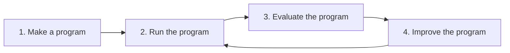

# Language Model Evaluation Harness

`lmeh` evaluates and optimizes *functions that use an LM* to accomplish a goal.

> Such functions or programs do not refer only to the bare completion call, but they can be surrounded by arbitrary deterministic code that prepares the prompt (pre-processing) and refines the model's output (post-processing).

In the refinement loop below, `lmeh` provides the primitives for you to define the metrics that judge how well your program performs (3). Then, it can use those scores to drive automated improvements on the prompt template (4).



## Modules

The loop above maps directly onto the package layout. Each step has a module that owns the relevant types and entry points.

| Step | Module | Role | Key API |
| --- | --- | --- | --- |
| 1. Make a program | [`lmeh.program`](src/lmeh/program.py) | Wire what is under test | `Program`, `Example`, `Experiment`, `LMConfig` |
| 2. Run the program | [`lmeh.run`](src/lmeh/run.py) | Execute a program on one dataset row | `run_trial`, `Trial` |
| 3. Evaluate the program | [`lmeh.evaluate`](src/lmeh/evaluate.py) | Score trials and run full experiments | `Metric`, `run_experiment`, `RunResults`, `default_llm_judge` |
| 4. Improve the program | [`lmeh.optimize`](src/lmeh/optimize.py) | Search for a better prompt template | `optimize`, `Step`, `OptimizationResult` |

[`lmeh.report`](src/lmeh/report.py) sits alongside evaluation and optimization: it renders `RunResults` and optimization trajectories as markdown (`render_run`, `render_history`).

In practice, steps 2 and 3 are usually composed through `run_experiment`, which runs every example, scores every metric, and returns a `RunResults`. Step 4 calls that same function in a loop, proposing new templates and keeping the best checkpoint.

```python
from lmeh.program import Example, Experiment, LMConfig
from lmeh.run import run_trial
from lmeh.evaluate import run_experiment, LLMJudgeMetric, default_llm_judge
from lmeh.report import render_run
from lmeh.optimize import optimize, render_history
```

See the [getting started notebook](getting_started.ipynb) for a full working example of this cycle end to end.

## Optimization

Prompt-template search (OPRO-style) treats evaluation as **multi-criteria**: each candidate is scored on several normalized metrics, forming a quality vector in metric space. Before comparing checkpoints, that vector is collapsed by a fixed **linear scalarization**—the unweighted mean of per-metric means (`RunResults.overall.mean`), a compensatory aggregation where gains on one metric can offset losses on another. The search is therefore **single-objective** in template space: it maximizes one scalar utility, keeps the best checkpoint seen so far, and does not explore a Pareto front over metrics. The proposer still receives per-metric breakdowns in the trajectory (`render_history`); only ranking and early stopping use the headline score.

Inspired by DSPy, Ragas, OPRO.

## License
MIT

_Made with [mold](https://github.com/nachollorca/mold)_
